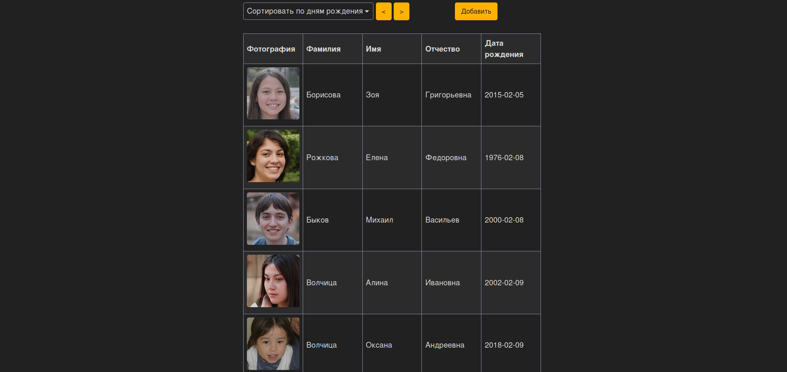
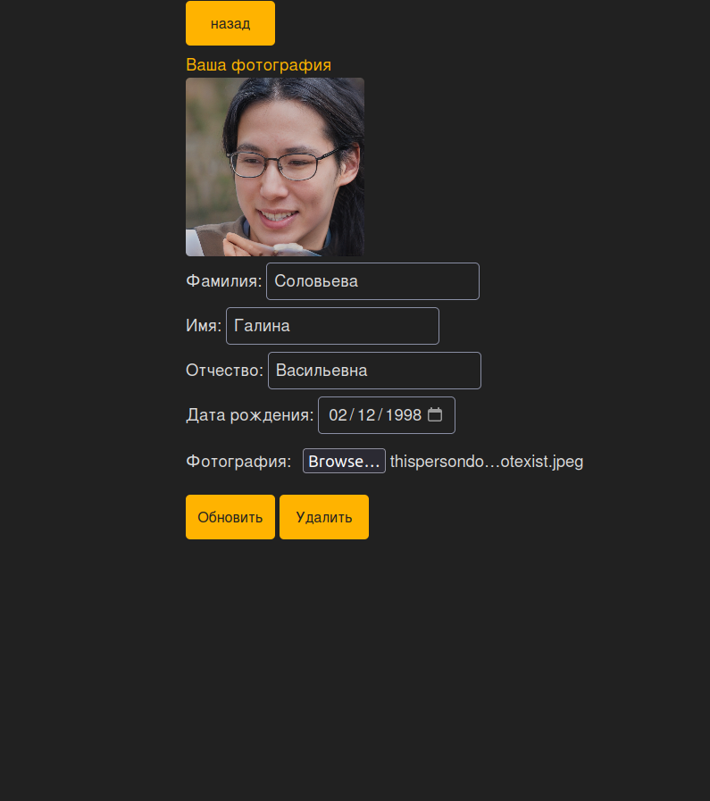
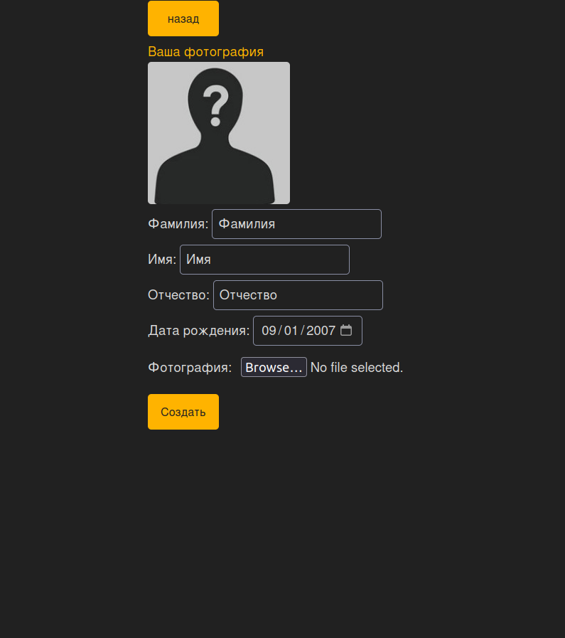

## Web Birthday App
 
## Функциональность приложения: 
#### • Отображение всего списка ДР  
#### • Отображение списка сегодняшних и ближайших ДР  
#### • Добавление записей в список ДР
#### • Удаление записей из списка ДР
#### • Редактирование записей в списке ДР

SPA веб-приложение, сервер предоставляет АПИ (ASP.NET Core Web API), информация хранится в объектах, персистентность которых реализуется с помощью использования БД. Корневая страница выводит список сегодняшних и ближайших ДР, остальная функциональность доступна на отдельных страницах, ссылки на которые ведут с корневой. Реализовано хранение и отображение фотографий.

## Главная страница:



| Личная страница пользователей | Cтраница создания новых |
|:-----------------------------:|:-----------------------:|
|        |  |


## Как запустить:

```bash

git clone https://github.com/AlexeyPeov/BDWebApi.git
git checkout master

```
Базу данных можно запустить через докер
```bash
docker build --rm -t pg -f Dockerfile.pgsql .
docker run --rm -d -p 5431:5432 pg
```

А можно просто в appsettings.json стрингу поменять если бд уже есть

```json
"ConnectionStrings": {
    "BDConnStr": "Host=localhost;Port=5431;Database=birthday;Username=postgres;Password=password;"
},
```

Далее:
```bash
cd WebBirthdayApp
dotnet ef database update
dotnet run
```
